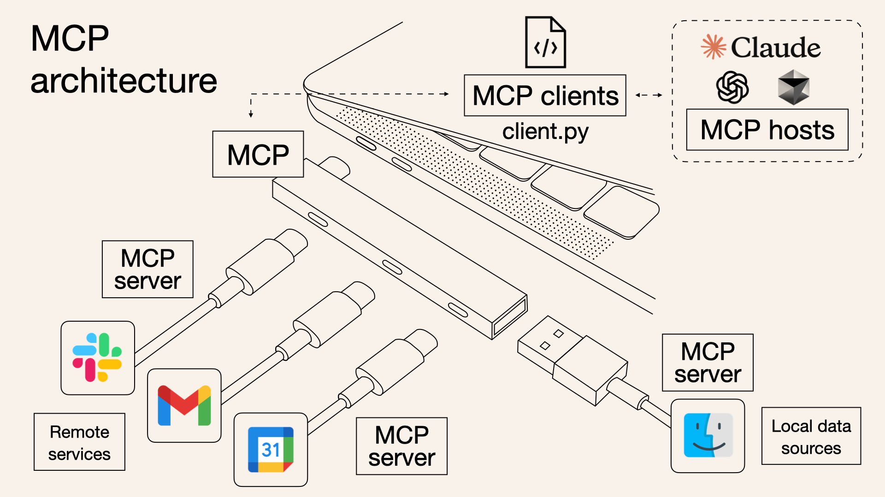

# What is MCP (Model Context Protocol)

"MCP stands for Model Context Protocol, an open standard introduced by Anthropic in November 2024.

Its purpose is to improve how AI models interact with external systems, not by modifying the models themselves, but by providing them structured, secure access to real-world data, tools, and services.

An MCP server is a standalone service that exposes specific capabilities such as reading files, querying databases, invoking APIs, or offering reusable prompts, in a standardized format that AI models can understand.

Rather than building custom integrations for every individual data source or tool, developers can implement MCP servers that conform to a shared protocol.

This eliminates the need for repetitive boilerplate and reduces complexity in AI applications." [Reference: https://itsfoss.com/mcp-servers/]

See USB-C example of how MCP servers work from Norash Sarkal's blog

[Reference: https://norahsakal.com/blog/mcp-vs-api-model-context-protocol-explained/]

See image below from Norah Sakal's Blog:



## MCP Server Template

A minimal C++ MCP (**Model Context Protocol**) server supporting:
- Raw TCP socket (custom protocol)
- HTTP (for browser/web clients, including LLM relay)
- CoAP (UDP, for IoT/embedded)

## LLM Integration

The HTTP server exposes a `/llm` endpoint.  
Send a POST request with a JSON body containing a `prompt` field.  
The server will forward the prompt to OpenAI's GPT API and return the response.

**Example:**
```sh
curl -X POST http://localhost:8080/llm -H "Content-Type: application/json" -d '{"prompt":"What is the capital of France?"}'
```

**Response:**
```json
{"response":"The capital of France is Paris."}
```

**Note:**  
You must provide your OpenAI API key in a file named `openai_api_key.txt` in the project root.

## Configuration

Edit `config.json` to set ports:
```json
{
  "tcp_port": 5000,
  "http_port": 8080,
  "coap_port": 5683
}
```

## Build

```sh
sudo apt update
sudo apt install build-essential cmake libcurl4-openssl-dev
git clone <repo-url> mcp-server
cd mcp-server
cmake -B build
cmake --build build
```

## Run

```sh
cd build
./mcp_server
```

## Deploy as .deb

1. Edit `debian/control` for package info.
2. Build the binary as above.
3. From project root:
   ```sh
   dpkg-deb --build . mcp-server.deb
   ```
4. Install:
   ```sh
   sudo dpkg -i mcp-server.deb
   ```

## Installing Debian package in WSL, running MCP server on WSL and accessing from Windows

From Windows to WSL: To find the IP address of a WSL instance, use:

wsl hostname -I
From WSL to Windows: To get the Windows host's IP address from within WSL:

ip route show | grep -i default | awk '{ print $3 }'

Reference:

https://learn.microsoft.com/en-us/windows/wsl/networking

## Notes

- **MCP** stands for **Model Context Protocol**.
- TCP: Connect with `telnet localhost 5000`
- HTTP: Visit `http://localhost:8080`
- CoAP: Use a CoAP client (e.g., `coap-client`)